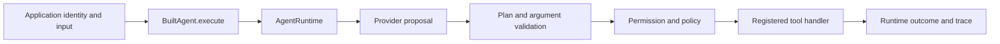
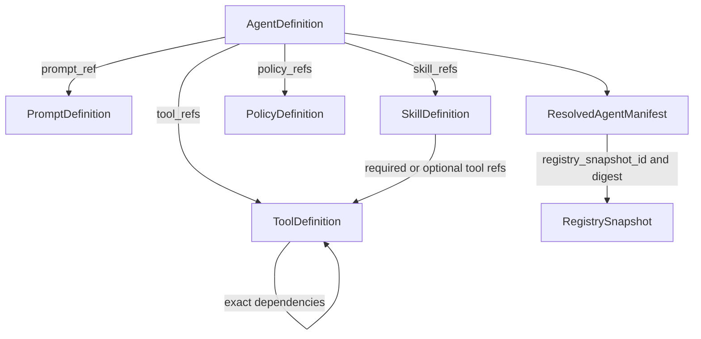
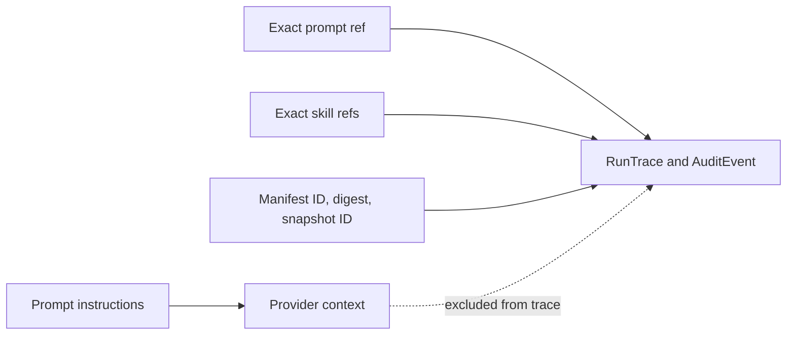
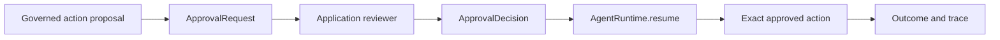
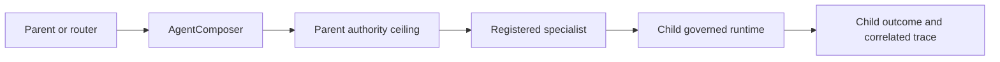
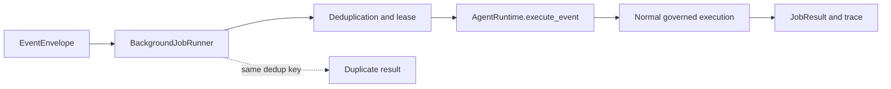
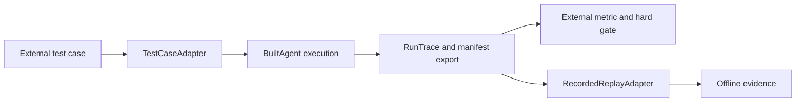

# Architecture diagrams

These diagrams show the main public paths. A box that says `application` is
owned by the consuming application.

## Governed execution

The provider proposes work. The runtime decides if the tool can run.

## Versioned artifact graph

The agent's explicit `tool_refs` are the execution ceiling. Skill links
describe reusable behavior and dependencies; they do not grant a tool.
Snapshots preserve the exact graph used by factory validation.

## Provenance without prompt leakage

Trace and audit evidence identifies the prompt and skills without storing
prompt instructions, raw provider content, or private reasoning by default.

## Approval pause and resume

The request and decision use the same action digest. A missing or stale
decision does not call the handler.

## Router and specialist delegation

Delegation can reduce authority. It cannot add tools, permissions, risk, or
delegation depth.

## Event-driven execution

The runner handles one event identity. A duplicate does not start a second
governed execution after the first event completes.

## External evaluation boundary

Evaluation code consumes exported evidence. It does not enter the runtime
governance path or perform live actions during recorded replay.
